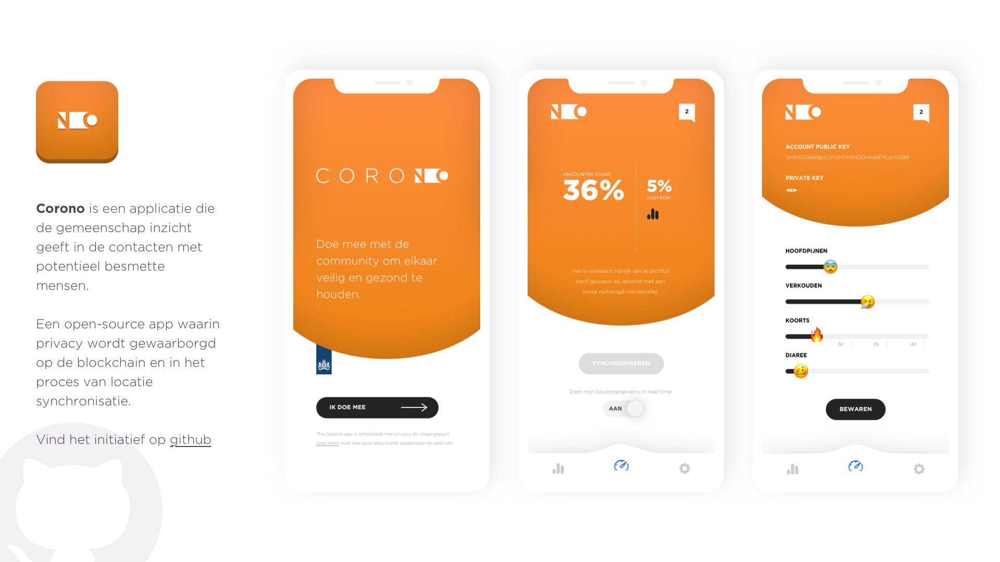

# Corono
an open source initiative to build a privacy first mobile app which tracks Corona symptoms and digitizes a form of contact research. This repository includes app development in React-Native. For other related projects in the build of Corono please see links on the bottom of document.

[Watch a prototype screencast here](https://vimeo.com/407269864)

## Privacy
The big challenge in Europe to launch such an application is privacy. How do we manage privacy in sharing ones medical information without breaching ones right for privacy.

## Solution
The Corono app is a blockchain-based project that allows its users to:
* input and update information about possible symptoms
* check whether you've been close to someone with a high risk-profile
* share only necessary information with the eco-system without compromising privacy

Blockchain technology allows us to build a system in which users share anonymized pieces of information without disclosing all available data. This improves anonymity and privacy and just gives the feedback on one single important question:

**Have you been in close contact with someone who shows to have a high risk profile?**

*Potential infection based on user input*

## Specifications
Underneath a first global outline of the app's specifications:

* create an account on the blockchain (preferred solution: Stellar SDK)
* users will only be known to the eco-system with a hash of their public key and a set of other unique local vars.
* users can only update or view information with their private key (through a transaction).
* account data is stored on the blockchain.
* location (GPS) data is stored locally to safeguard privacy and synced with the system by user-intent only, unless the user gives consent to share location data in real-time (see app screens).
* location-data is stored with a hash of the user's public key and a set of other unique local vars to maintain anonimity.
* location data only serves to build heat maps and check the aggregated and individual anonymised COVID scores of people in the user's proximity while moving around.
* the app only shares a hash of the user's public key and a set of other unique local vars and what other users (hash and COVID score) have been in their proxomity.

## Projects

Website development  
Dedicated repository: [Website](https://github.com/roecks/corono-website) 

API development (Laravel)  
Dedicated repository: [API](https://github.com/roecks/corono-api)

Data development  
Dedicated repository: [Data](https://github.com/roecks/corono-data)

## References

React Native: [Official website](https://reactnative.dev/)  
Stellar Developer Docs: [Documentation](https://www.stellar.org/developers/guides/)  
Emojis: [Emoji Stack](https://emojipedia.org/)  

## Module Dependencies
We have paid extra attention to keeping the number of depencies low to mitigate the risk of vulnerabilities and to enable faster code auditing:
[react-native-geolocation](https://github.com/react-native-community/react-native-geolocation). 
[react-native-modal](https://github.com/react-native-community/react-native-modal)  
[react-native-svg](https://github.com/react-native-community/react-native-svg)  
[@react-native-community/async-storage](https://github.com/react-native-community/async-storage)  
[@react-native-community/art](https://github.com/react-native-community/art)  
[d3](https://github.com/react-native-community/art)  

